# UCSD-Cloud-Cli 0.1.0

This tool set is designed to enable command-line-level access to common functions related to the security workflow(s) defined within this readme document for the UCSD team to use when configuring their Amazon Web Services environment(s).

This process is based off of the AWS Documentation related to cross-account log shipping here: https://docs.aws.amazon.com/AmazonCloudWatch/latest/logs/CrossAccountSubscriptions.html

## Note on Usage Patterns

This document defines 3 usage patterns:

* Installed locally
* In-place Development using VirtualEnvironments
* Docker containerized deployment

In all cases, the output is identical - the three workflows execute the same exact code. For the purposes of this document, in examples pertaining to command-line interactions the following command components are fully interchangable:

* `ccli` or `ucsd_cloud_cli` - for the installed python package method
* `python -m ucsd_cloud_cli` - for the local development execution method
* `docker run ucsd_cloud_cli` - for the Docker containerized method

## Development Environment Prerequisites

To work on this toolset, you will need several basic requirements installed. We follow a very idiomatic/standard setup for working with Python:

* Python >= 3.4
* [virtualenv](https://pypi.python.org/pypi/virtualenv)
* [virtualenvwrapper](https://virtualenvwrapper.readthedocs.io/en/latest/)

Assuming you're working on a mac and have [homebrew](https://brew.sh) installed, the following will install these prerequisites on an OSX machine:

```bash
brew install python3
pip3 install virtualenv
pip3 install virtualenvwrapper
```

For Ubuntu or other Debian based machines, the basic dependencies are very similar:

```bash
sudo apt-get install -y python3
pip3 install virtualenv
pip3 install virtualenvwrapper
```

`virtualenvwrapper` also requires a bit of configuration locally to ensure that it can be used from the terminal properly. Per it's [documentation](https://virtualenvwrapper.readthedocs.io/en/latest/#introduction) you'll want to souce the init script in any terminal session you want to use the toolset in. Additionally, as we're working in python3, you'll want to set an environment variable to indicate to `virtualenvwrapper` which python executable to use. This can be accomplished with the following command, either run in the terminal each time you want to use it, or otherwise added to your environment via `~/.bashrc` or `/etc/bash.bashrc` or otherwise added to your [machine's environment](http://timmyreilly.azurewebsites.net/setup-a-virtualenv-for-python-3-on-windows/) variables:

```bash
VIRTUALENVWRAPPER_PYTHON=/usr/local/bin/python3
source /usr/local/bin/virtualenvwrapper.sh
```

## Installation

Installation of this project from the command line is simple:

* Download and (if applicable) un-archive this project to a directory of your choosing
* From the command line, navigate to the directory where the `setup.py` script is (should be the directory that was created via `git clone` or when the downloaded zip file was unarchived)
* Before you install, create a virtual environment for this project: `mkvirtualenv -p <path_to_python3> ucsd`
  * if/when you exit and return to the command line, re-enable the `ucsd` virtualenv with the following command: `workon ucsd`
* Run the `setuptools` install process with the following command: `python setup.py install`
* From here, you should have a `ucsd_cloud_cli` command that runs the code within this project installed to your python packages directory


## Using the Docker Image

If you'd prefer to use the Docker image and have Docker installed locally, once you've downloaded (`git clone` or otherwise) this project, you can build with the following command:

```bash
docker build -t ucsd_cloud_cli -f Dockerfile .
```

For Windows-based machines running Docker, please make sure you've set [Docker to run for Linux Containers](https://github.com/docker/for-win/issues/1224) (depending on Docker version) or dig into the information on [LinuxKit setup for Docker](https://blog.docker.com/2017/09/preview-linux-containers-on-windows/).

This will build an `alpine` and `python3.6`-based docker container named `ucsd_cloud_cli` locally. Running the Command Line Interface (CLI) through this interface is straightforward. Note that the specific commands, arguments, options and means of interacting with this CLI toolset are further defined in the [Click-CLI](#click-cli) section below.

```bash
docker run -v $(HOME)/.aws:/root/.aws ucsd_cloud_cli <command> <arguments> <options> --dry-run
```

This is functionally equivalent to running the above command `ucsd_cloud_cli <command> <arguments> <options>` with the benefit of running it in an consistent Docker container. Note that we also assume that you've set up a local credentials file and we simply map it in via a volume mount to the container.

## Installed Dependencies

This toolset leverages the following core dependencies:
* [boto3](https://boto3.readthedocs.io/en/latest/) sdk - AWS programmatic interactions
* [click](http://click.pocoo.org/5/) - handles the command-line experience and interface
* [troposphere](https://github.com/cloudtools/troposphere) - used to compose CloudFormation templates to avoid string-based JSON errors and other easy to make mistakes.
  * this is truly a time saver and avoids the frustration of building large CloudFormation by offering programmatic syntax and structural validation checks

## Configuring AWS Plugin for Splunk

UCSD is utilizing the [AWS Plugin](http://docs.splunk.com/Documentation/AddOns/released/AWS/Setuptheadd-on) for Splunk which will need to be configured after the overall log shipping/centralization templates have been installed in each AWS account.

The following will be configured to flow logs into S3:

* CloudTrail

This process will then fire SQS notifications which Splunk will use to determine which file(s) to pick up and ingest from the S3 bucket(s) configured. Within Splunk, the [SQS-based S3 input](http://docs.splunk.com/Documentation/AddOns/released/AWS/SQS-basedS3) should be used and wired up to the proper queue(s) and credentials.

CloudWatch Logs have a specific structure for ingest into Splunk via the [Cloudwatch Log Input](http://docs.splunk.com/Documentation/AddOns/released/AWS/SQS-basedS3).

The `target` template which is to be installed on the account for use as the 'centralized logging repository' creates an IAM user and (optionally, based on including the `--output-keys` flag at the time the template is generated) a set of credentials that are included in the CloudFormation template outputs for copy/paste into the Splunk configuration for the AWS plugin. Otherwise, the only manual step required here is to go to the IAM console, find the IAM user specified by the CloudFormation Output `splunkAccountUserName` and generate a set of AWS API credentials for use within the Splunk AWS Plugin config.

## Click CLI

Click offers a simple CLI integration tool set that has a rich set of parsers and help functions to make the user's experience as simple as possible. Note that the screen shots below were run on a development machine. When installed, rather than typing `python -m ucsd_cloud_cli` from the same directory of the project, the `ucsd_cloud_cli` command will be available whenever the proper `virtualenv` is enabled (in our case above, named `ucsd`)

### Top Level Help

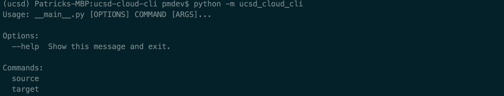

The top level help shows the various commands available. Since this is a hierarchical set of commands, there are a few different pathways to manage logging source and target CloudFormation scripts/deployments.

### Target Generate Arguments and Options

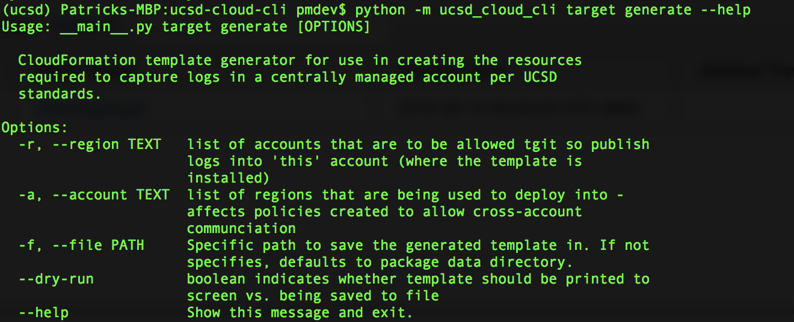

This image shows the help string when a user is attempting to generate the log target CloudFormation script. Note that details are pulled from the [docstring](https://www.python.org/dev/peps/pep-0257/) for the description of the command.

### Source Generate Arguments and Options

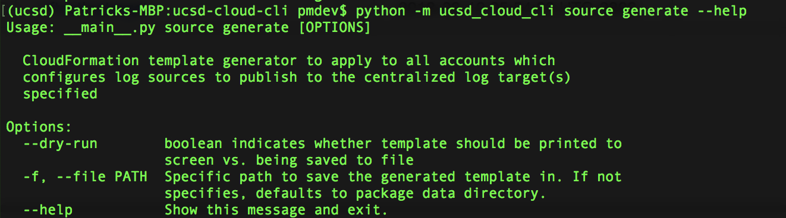

This image is a screenshot of the parameters available when generating a CloudFormation template to point a given account's logs to the 'Target' account configured with the template generated above.

### Source flow_log Arguments and Options

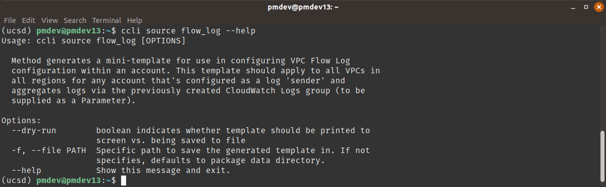

This image is a screenshot of the parameters available when generating a CloudFormation template to point a given VPC's flow logs to the in-account setup (as created by the `ccli source generate` template) to forward on for centralized storage.

### Prompt handling for CLI use

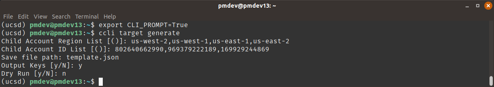

The above shows the CLI prompting the user for values including multi-value inputs that are parsed as comma separated value strings. To enable this at the command line, set the `CLI_PROMPT` environment variable to `TRUE`:

```bash
export CLI_PROMPT=TRUE
```

Options and arguments can be passed in via prompt or in non-interactive mode depending on whether or not this environment variable is set.

# Process Flows

## Log Data Flow

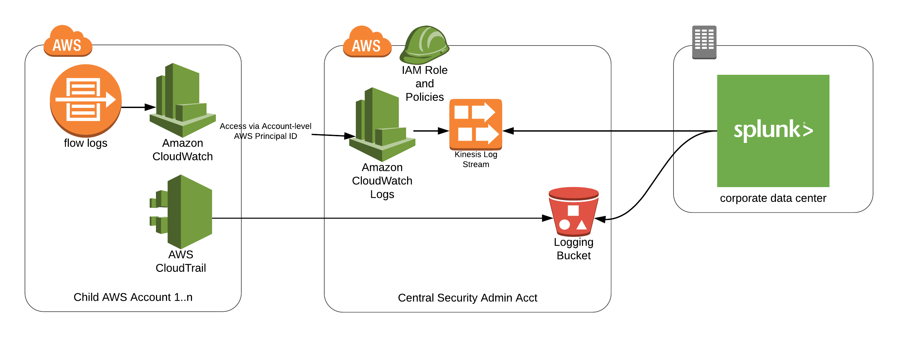

Setting up logging requires several steps to configure the 'log receiver' account and all other accounts:

* First, generate the 'log_targets' CloudFormation script for the accounts being targeted. Run the following command with one `-a` option specified per AWS account in-scope. As new accounts are added, simply re-run with all account id's and update the stack.

```bash
python -m ucsd_cloud_cli target generate -a 802640662990 -a 969379222189 -a 169929244869 --output-keys -f "$(pwd)/log_targets.json"
```

* Next, go to the account where logs will be deposited and deploy the generated CloudFormation template.

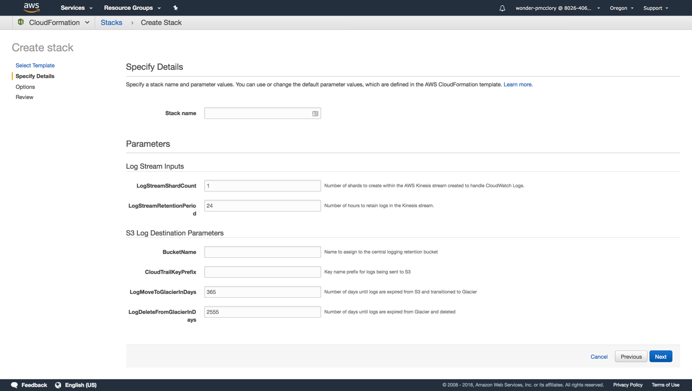

* Inputs will default for everything that can be defaulted, the following values will require inputs:
    * Stack Name - name this something memorable. This affects only the visible name of the stack in the AWS API/Console
    * Log Stream Inputs
        * `LogStreamShardCount` - Number of shards to create in Kinesis stream - adding more shards increases performance but adds to cost.
        * `LogStreamRetentionPeriod` - Number of hours log entries will be retained
    * S3 Log Destination Parameters
        * `BucketName` - name to assign to the S3 bucket
        * `CloudTrailKeyPrefix` - key name prefix for where CloudTrail will put files - it's ok (and normal) to leave this blank
        * `LogMoveToGlacierInDays` - age in days when files in S3 will be migrated to Glacier storage class
        * `LogDeleteFromGlacierInDays` - age in days when files in Glacier will be deleted
* Note the outputs from the `log_targets.json`-generated stack.

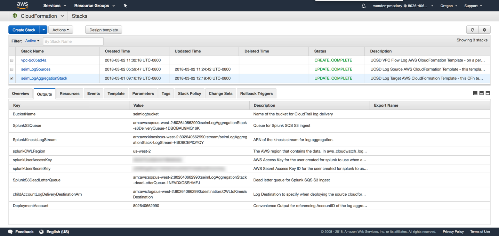

* Next, for all accounts, deploy the `log_sources.json` template. The same template is used for all accounts and a pre-generated version can be found in this repository [here](ucsd_cloud_cli/data/cloudformation/log_aggregation/log_sources.json). Inputs for this template should be sourced from the outputs of the previous deployment of the `log_targets.json` template.

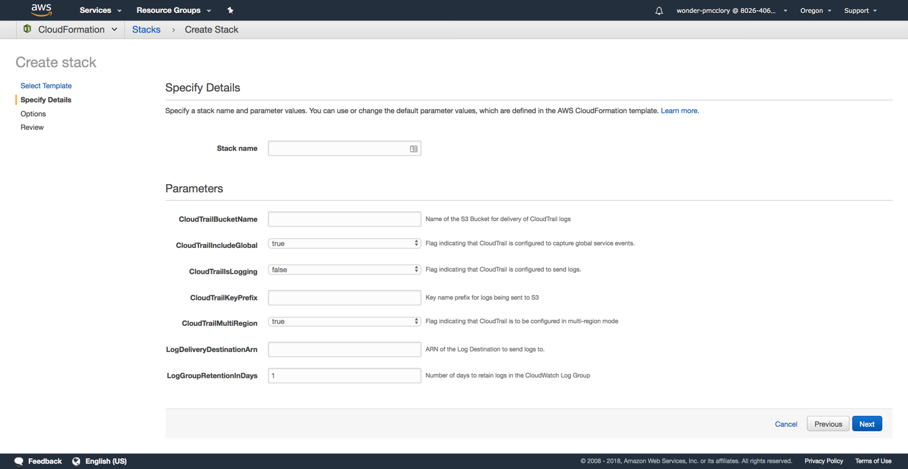

* Inputs should map as follows [input name in `log_sources.json` template <- output name from `log_targets.json`]:
    * `CloudTrailBucketName` <- output value `BucketName` from deployed `log_targets.json` stack
    * `CloudTrailIncludeGlobal` - flag indicating that CloudTrail is capturing global events
    * `CloudTrailIsLogging` - flag indicating that CloudTrail logging is enabled (defaulted to False)
    * `CloudTrailPrefix` - key name prefix for where CloudTrail will put files - it's ok (and normal) to leave this blank
    * `CloudTrailMultiRegion` - flag indicating that CloudTrail is capturing events across regions
    * `LogDeliveryDestinationArn` <- output value `childAccountLogDeliveryDestinationArn` from deployed `log_targets.json` stack
    * `LogGroupRetentionInDays` - number of days the log group will buffer logs
* Note the expected outputs for the deployment of the `log_sources.json` stack:

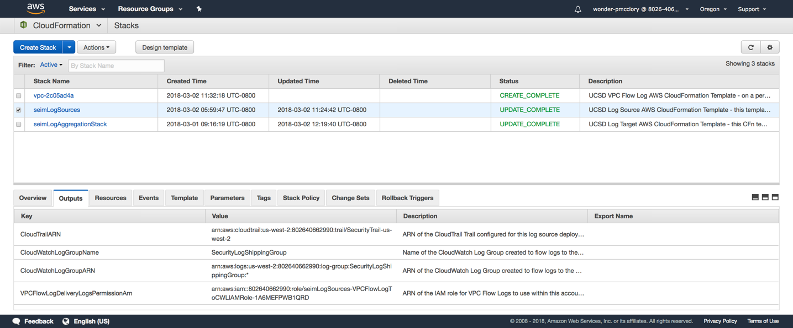

* To deploy the VPC Flow Logging setup, you will need to create one stack per VPC using the `vpc_flow_log.json` static template. A pre-generated copy can be found [here](ucsd_cloud_cli/data/cloudformation/log_aggregation/vpc_flow_log.json). Deploy this once per VPC deployed.

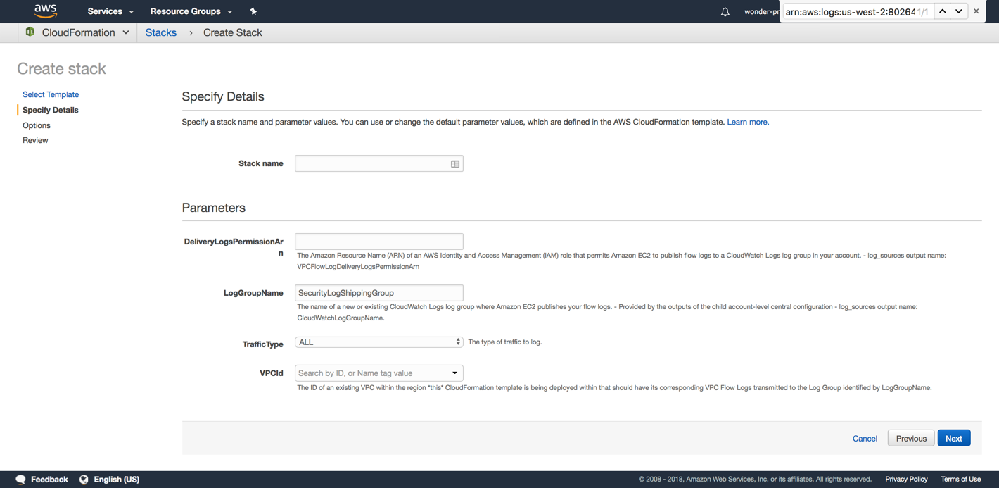

* Input mapping for this template sources one value from the deployment of the `log_sources.json` template in the same account:
    * `DeliveryLogsPermissionArn` <- output value `VPCFlowLogDeliveryLogsPermissionArn` from deployed `log_sources.json`
    * `LogGroupName` <- output value `CloudWatchLogGroupName` from deployed `log_sources.json`
    * `TrafficType` - Type of traffic to be captured. See [AWS Docs](https://docs.aws.amazon.com/AWSCloudFormation/latest/UserGuide/aws-resource-ec2-flowlog.html#cfn-ec2-flowlog-traffictype) for more information.
    * `VPCId` - Lookup for the VPC to apply this logging setup to

### Splunk Add-On Configuration

Install the [AWS plugin](https://splunkbase.splunk.com/app/1876/) manually on the Index splunk server. Configuration documentation is available [here](http://docs.splunk.com/Documentation/AddOns/latest/AWS/Description)

* Install the AWS Plugin manually on the Indexer within the existing Splunk deployment.

#### Add AWS account to plugin configuration

At the home page, once you login to Splunk Enterprise, click *“Splunk Add-on for AWS”* in the navigation bar to the left.

1. At the top of the screen click on *Configuration* in the app navigation bar. The Account tab by default will be selected.
1. Click the *Add* button to the top right of the screen.
1. Enter a name that describes the function of the connection to the account is connected to.  Be sure to use the standard UCSD naming format policy (not sure what that is please add)
1. Enter the *Key ID* and *Secret Key* for an AWS account that the Splunk platform should use for access. This information can be found in: *AWS Account > Management Services > CloudFormation > seimLogAggregationStack > Outputs* under *splunkUserAccessKey* and *splunkUserSecretKey*. *splunkUserAccessKey = Key ID* and *splunkUserSecretKey = Secret Key*.
1. Select “Global” for the *Region Category*.
1. Click *Add*.

#### Configure Inputs

Currently there are 2 inputs you need to configure, CloudWatch Logs that come in via Kinesis and CloudTrail Logs via S3 and SQS.

*CloudTrail via S3 and SQS:*

1. At the top of the screen click on *Inputs* in the app navigation bar. The Account tab by default will be selected.
1. Click the *Create New Input* button to the top right of the screen.
1. Select *CloudTrail > SQS Based S3*
1. Enter a name that describes the type of input and method.  Be sure to use the standard UCSD naming format policy (not sure what that is please add)
1. In *AWS Account* select *seimLogAggregationStack*
1. In *AWS Region* select *US West (Oregon)*
1. In *SQS Queue Name* select *seimLogAggregationStack-s3DeliverQueue-...*
1. Click *Submit*

*CloudWatch logs via Kinesis:*
1. At the top of the screen click on *Inputs* in the app navigation bar. The Account tab by default will be selected.
1. Click the *Create New Input* button to the top right of the screen.
1. Select *Custom Data type > Kinesis*
1. Enter a name that describes the type of input and method.  Be sure to use the standard UCSD naming format policy (not sure what that is please add)
1. In *AWS Account* select *seimLogAggregationStack*
1. In *AWS Region* select *US West (Oregon)*
1. In *Stream Name* select *seimLogAggregationStack-LogStream-...*
1. In *Record Format* select *CloudWatchLogs*
1. In Source Type select *aws:kinesis*
1. Click *Submit*

*(Optional) VPCFlowLogs via CloudWatch via Kinesis:*

1. At the top of the screen click on *Inputs* in the app navigation bar. The Account tab by default will be selected.
1. Click the *Create New Input* button to the top right of the screen.
1. Select *Custom Data type > Kinesis*
1. Enter a name that describes the type of input and method.  Be sure to use the standard UCSD naming format policy (not sure what that is please add)
1. In *AWS Account* select *seimLogAggregationStack*
1. In *AWS Region* select *US West (Oregon)*
1. In *Stream Name* select *seimLogAggregationStack-LogStream-...*
1. In *Record Format* select *CloudWatchLogs*
1. In *Source Type* select *aws:cloudwatchlogs:vpcflow*
1. Click *Submit*

Note: further configurations may be needed after longer periods of testing (i.e. batch size)


## Instance Isolation Workflow

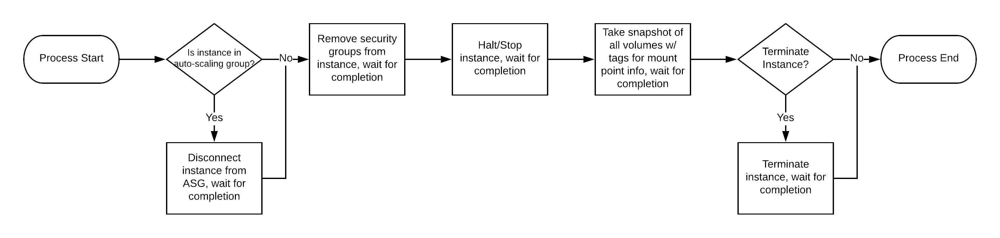

# Test Data

| Name | Account ID |
|------|------------|
| Secuity Test Account | 802640662990 |
| UCSD Test | 969379222189 |
| Infrastructure Test Account | 169929244869 |

## Test/Validation Commands

Command to generate target CloudFormation template for our 3 test accounts:

```bash
python -m ucsd_cloud_cli target generate -a 802640662990 -a 969379222189 -a 169929244869
```
